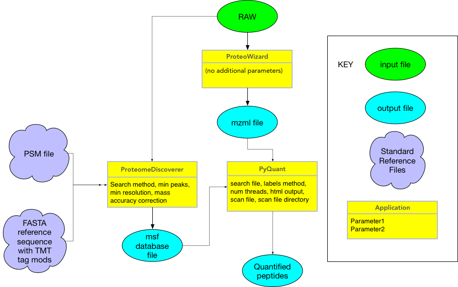

# Overview of lcms-pyquant
This module describes the processing of mass spectrometery data from existing msf and associated mzml files to quantify the amount of proteins present in a sample. The file types that are needed for processing are listed below. *These files must be put in the same directory.*:

* msf = search file that conducts that the peptide-spectrum match. This is an output from Proteome Discoverer - a Thermofischer tool that handles our matching right now.

* mzml = raw scan file that houses metadata about the scan as well as a binary representation of actual spectrum per scan. A scan is defined as a chromatogram that is collected between a specific set of time points. More documentation on mzml files can be found here: http://www.peptideatlas.org/tmp/mzML1.1.0.html

The core library that is being used is called pyquant and more detailed documentation can be found here: https://chris7.github.io/pyquant/ Here is how all the pieces fit together:



## Running the Container
To run the container, you will need msf and its associated mzml file to be in the same directory. Go to the lcms-pyquant-job.json file and you will see an example that looks like this:

```
{
  "name": "pyquant-job-test",
  "appId": "lcms-pyquant-0.1.0",
  "archive": false,
  "inputs": {
    "search_file": "agave://data-tacc-work-meslami/exp1720-03-ds259268.msf"
  },
  "parameters": {
    "output": "output-exp1720.tsv"
  }
}
```
Then conduct the following steps:
1. Change the "name" to be something meaningful to you
2. Provide a "search_file" that points to a file somewhere on TACC
3. Provide a "scan_file" that points to a file somewhere on TACC
4. Name the output file for your processing.
5. You also have the option to define "archive" settings in the json -- see a TACC rep for that.

Note that current hard-coded parameters within the workflow are:
```
--isobaric-tags --label-method TMT10 --no-ratios -p9
```
We currently do not need the flexibility to adjust any of those. 

* Isobaric tags means that we are using a specific labeling scheme to multiplex samples
* label-method loads a file called TMT10 that stores how we labeled each sample
* no-ratios means we do not want to output ratios of samples that will make unit measurements across a column, and _[this currently seems buggy]_
* p9 is the number of "processors" to use for processing.


# Output Files:

1. outputname: mass spec data, for more info see: e.g. pyquant website. Its a tsv with columns as filename used to process file, peptide name, any modifications, charge state, MS2 scan ID, intensity. If applicable, you will have the intensity per label along with the label come out as well.
2. job_name-job_id.err = the status of the job within pyquant (Processing scans, % complete, etc is all printed out to this log rather than the .out log). This gets populated even if the job is a success (pyquant prints to syserr.log, will need to fix that later).
3. job_name-job_id.log = whether or not the job completed or failed

To get check status and pull these logs, you can use the standard TACC status, get, and get-output commands for jobs, respectively.

# TO DO ITEMS:

Things that have yet to be added are:
1. Provide the flexibility to ingest all msf/scan files from a directory
2. Define our own search file and create an equivalent of the msf file
3. Hook to Proteowizard with our Windows VM to generate our own RAW files.


# Intro to mzml files
The most important parameters to be aware of in the mzml file are:
* spectrumList = this variable will tell you total how many spectra are measured. You will have that many <spectrum index=”..” > entries each of which will have a <scanList> which tells you how many scans are in the spectrum that is being described. Most stuff we will be working with will have a <scanList count=”1”> which means there is only one scan in the spectrum that is there. Note, each ion that flies off the sample generates its own spectrum. 
The spectrum has a another set of parameters as well such as:
* Mslevel
* Positive scan
* Base peak m/z → the m/z that has the highest intensity
* Total ion current for that spectrum
* Lowest observed m/z
* Highest observed m/z
Once you get through all those parameters, then it will start to break down the scans in the spectrum (again, normally you will only have one scan per spectrum) and so you will then hop into the scan information, which because there is only a single scan in the spectrum houses the spectrum data. 
* scan = The actual MS data is in here
* peaks = This is the actual data encoded in base64. Byte order must be network. The format is m/z (Da) - Intensity
* precision = number of bits used by each component
* msLevel = 1: MS 2: MS/MS ...
* peaksCount = Total number of m/z-intensity pairs in the scan
* polarity = +: positive -: negative any
* centroided = This only matters if centroided attribute of dataProcessing element is 0 or absent. This attribute should be used only if some scans were processed and others not. If all scans were processed, than the corresponding attribute form the dataProcessing element should be used instead.
* basePeakMz = m/z of the base peak (most intense peak)
* basePeakIntesnity = Intensity of the base peak (most intense peak)
* startMz = Setted low m/z boundary (this is the instrumetal setting)
* retention time = Retention time of the scan
* endMz = Setted high m/z boundary (this is the instrumetal setting)
* lowMz = Observed low m/z (this is what the actual data looks like)
* highMz = Observed high m/z (this is what the actual data looks like)
* totIonCurrent = Total ion current (total intensity in the scan)
* scanCount = Total number of scans contained in the XML instance document. This number should be equal to the total number of scans in the original RAW data, unless some were not converted (e.g: signal below threshold).