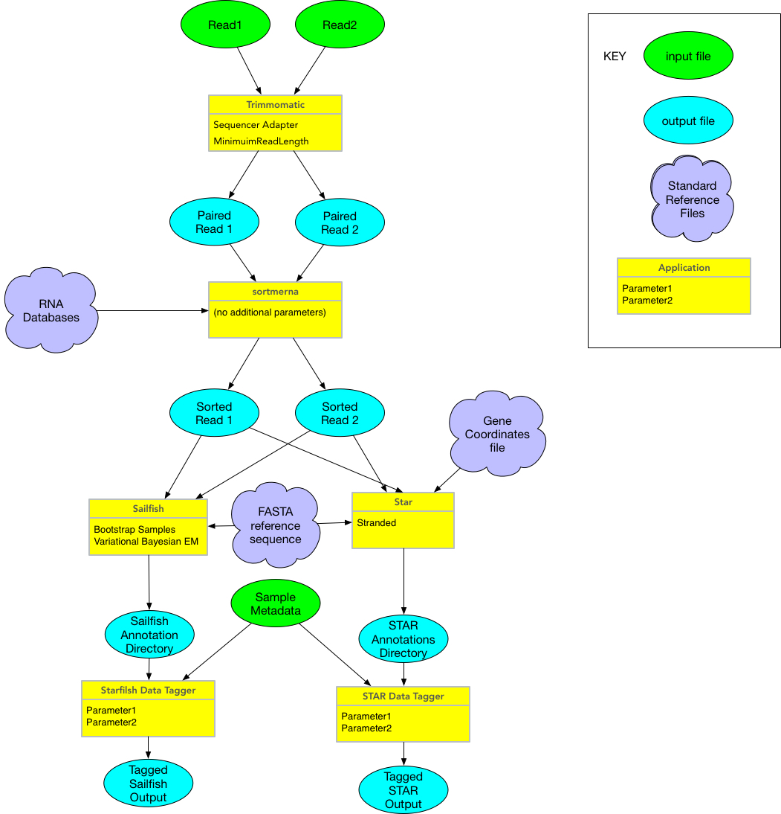

#RNASeq reactor
#
This ETL step runs up to two applications on single or double read
sequences:

* Trimmomatic to trim raw reads 
* Sortmerna to remove known sequences

There three inputs needed and four options in the json file.  Inputs are

* **read1** the fastq of the first (or only) sequence read 
* **read2** the fastq of the second read (or to signal there is no read2 
use the empty file
agave://data-sd2e-community/sample/rnaseq/test/ENOSUCH_R2.fastq.gz) 
* **filterseqs** The directory with the databases of rna sequences to
reject in the format used by sortmerna in a single directory plus a file
named *config* which has the command argument to pass to sortmerna

The default **filterseqs** from Q0 is located at
*agave://data-sd2e-community/reference/rna_databases/rRNA_databases*

Note the **filterseqs** should have no path information to the files but
should have all the other information in the format of

```rnadb_list
rRNA_databases/silva-bac-16s-id90.fasta,rRNA_databases/silva-bac-16s-db:
rRNA_databases/silva-bac-23s-id98.fasta,rRNA_databases/silva-bac-23s-db:
rRNA_databases/silva-arc-16s-id95.fasta,rRNA_databases/silva-arc-16s-db:
rRNA_databases/silva-arc-23s-id98.fasta,rRNA_databases/silva-arc-23s-db:
rRNA_databases/silva-euk-18s-id95.fasta,rRNA_databases/silva-euk-18s-db:
rRNA_databases/silva-euk-28s-id98.fasta,rRNA_databases/silva-euk-28s:
rRNA_databases/rfam-5s-database-id98.fasta,rRNA_databases/rfam-5s-db:
rRNA_databases/rfam-5.8s-database-id98.fasta,rRNA_databases/rfam-5.8s-db
```


The options for this applicaiton are

* **trim** (true,false) run trimmomatic on the read(s) 
* **adaptersfile** the adapter file used for trimming (Q0 value was
*TruSeq3-PE.fa:2:30:10*) 
* **minlen** the minlen value passed to sortmerna 
* **sortmerna** (true,false) run the sortmerna step

Note all three inputs and four options are required even if no
processing is to be done (this will be addressed in a future release of
agave).  Also all inputs must exist and be readable within the SD2E
environment.

When run, all cores available to the VM will be used for the processing.
The applicaition will autodetect the number of cores.

Examples of the job script can be found in the rnaseq-0.1.1 directory
*rnaseq-job.json.

Once completed, additional post processing steps are carried out 
to annotate the sequences.  These are separate applications, starfish
and rnaseq-broad, which can be run on any pairs of sorted reads.

